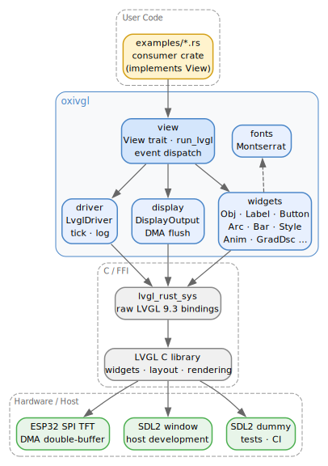

[](https://github.com/emobotics-dev/oxivgl/actions/workflows/ci.yml)
[](https://github.com/emobotics-dev/oxivgl/actions/workflows/ci.yml)
[](LICENSE)


# oxivgl

Safe Rust bindings for [LVGL](https://github.com/lvgl/lvgl) on embedded (`no_std`) and host (`std`/SDL2) targets. Wraps all unsafe LVGL calls behind type-safe APIs — user code never touches `unsafe` or `lvgl_rust_sys` directly.

## Status

oxivgl is under active development — fast-growing, frequently
refactored, and **not API-stable**. Module paths, type names, and method
signatures may change between commits. There are no semver guarantees
yet.

The intent is to publish on crates.io once the API has stabilized enough
for external consumers. Until then, depend on it via git.

## AI statement

This library has been developed using AI coding agents, mostly Claude
Code. The DMA/buffer foundations, architecture decisions, wrapper
implementations, memory safety reviews, example porting, and
documentation were built through human–AI collaboration.

The API is designed to be AI-friendly: discoverable, well-documented,
and free of footguns. Architecture and design boundaries are captured in
explicit specs. Rust's type system and borrow checker catch mistakes at
compile time that would silently corrupt memory in C — when an AI agent
generates widget code, the compiler enforces correct lifetimes, valid
enum values, and proper ownership. We envision AI agents as primary
users of this crate, generating embedded GUIs from high-level
descriptions.

Contributors are encouraged to use AI tools. The project's specs,
CLAUDE.md, and example patterns are structured to give AI agents the
context they need to contribute effectively.

## Architecture


<!-- regenerate: dot -Tsvg docs/architecture.dot -o docs/architecture.svg -->

### Key Types

**Application framework** — implement `View` to build a screen; `run_lvgl` drives the render loop.

| Type | Module | Role |
|------|--------|------|
| `View` | `view` | Trait: `create()` builds UI, `update()` refreshes per tick, `on_event()` handles input |
| `LvglDriver` | `driver` | Zero-sized init token — proves `lv_init()` was called |
| `SdlBuilder` | `driver` | Builder for SDL-backed driver: `.sdl(w,h).title().mouse().build()` |
| `Event` | `event` | Safe wrapper around LVGL events, passed to `View::on_event()` |

**Widgets** — type-safe wrappers, lifetime-tied to parent via `'p`.

| Type | Module | Role |
|------|--------|------|
| `Obj<'p>` | `widgets` | Base LVGL object — size, position, flags, styles |
| `Screen` | `widgets` | Active screen handle (`Screen::active()`) |
| `Label`, `Button`, `Arc`, `Bar`, `Slider` | `widgets` | Common widget wrappers |
| `Switch`, `Checkbox`, `Led`, `Dropdown`, `Roller` | `widgets` | Input/indicator widgets |
| `Image`, `Line`, `Scale` | `widgets` | Visual/gauge widgets |
| `Chart` | `widgets` | Chart widget (line, bar, scatter) |
| `Textarea` | `widgets` | Single/multi-line text input |
| `Buttonmatrix` | `widgets` | Matrix of buttons |
| `Keyboard` | `widgets` | On-screen virtual keyboard (linked to `Textarea`) |
| `List` | `widgets` | Scrollable list with icon+text buttons |
| `Menu` | `widgets` | Hierarchical menu with pages |
| `Msgbox` | `widgets` | Modal dialog with title, text, and buttons |
| `Canvas<'p>` | `widgets` | Off-screen drawing surface; owns its `DrawBuf`; `fill_bg()`, `set_px()`, `init_layer()` → `CanvasLayer`. Use `RGB565` on embedded (fits in RAM); `ARGB8888` for host-only effects. |
| `CanvasLayer<'c>` | `widgets` | RAII draw guard: `draw_rect()`, `draw_arc()`, `draw_line()`, `draw_triangle()`, `draw_image()`, `draw_label()`, `draw_letter()`; commits on `Drop`. Note: `draw_letter` with `rotation≠0` uses the vector font path — requires `ARGB8888` canvas internally. |
| `ValueLabel` | `widgets` | Label that formats a numeric value with a unit string |
| `Child<W>` | `widgets` | Non-owning wrapper — suppresses `Drop` (parent owns) |
| `ScaleBuilder` | `widgets` | Builder for `Scale` widget configuration |

**Style system** — two-phase: mutable build → frozen `Rc`-backed handle.

| Type | Module | Role |
|------|--------|------|
| `StyleBuilder` | `style` | Mutable builder: chain setters, call `.build()` |
| `Style` | `style` | Frozen, cheaply clonable `Rc<StyleInner>` handle |
| `GradDsc` | `style` | Gradient descriptor (linear, radial, conical) |
| `TransitionDsc` | `style` | Property transition with path function and timing |
| `Theme` | `style` | Extend the active LVGL theme; restores parent on `Drop` |
| `Palette` | `style` | Material Design color palette (18 colors) |
| `Selector` | `style` | Part + state combination for style targeting |

**Animation** — stack-local builder → LVGL-owned copy.

| Type | Module | Role |
|------|--------|------|
| `Anim<'w>` | `anim` | Animation builder, lifetime-tied to target widget |
| `AnimHandle` | `anim` | Handle to running animation; `pause_for()` |
| `AnimTimeline` | `anim` | Sequenced animation timeline |
| `Timer` | `timer` | Periodic timer with `triggered()` polling in `update()` |

**Input devices** — non-owning wrappers for querying LVGL input state.

| Type | Module | Role |
|------|--------|------|
| `Indev` | `indev` | Non-owning handle to active input device |
| `Point` | `indev` | 2D point (x, y) for movement vectors |

**Draw tasks** — custom draw hooks via `DRAW_TASK_ADDED` events.

| Type | Module | Role |
|------|--------|------|
| `DrawTask` | `draw` | Non-owning handle to LVGL draw task (callback-scoped) |
| `DrawDscBase` | `draw` | Base descriptor: part, id1, id2 (value copy) |
| `DrawLabelDsc` | `draw` | Borrowed label descriptor: color, text, font |
| `DrawLabelDscOwned` | `draw` | Owned label draw descriptor |
| `DrawRectDsc` | `draw` | Owned rect draw descriptor with builder setters |
| `DrawArcDsc` | `draw` | Arc draw descriptor (center, radius, angles, width, color) |
| `DrawLineDsc` | `draw` | Line draw descriptor (p1, p2 — `f32`; width, color, rounded caps) |
| `DrawTriangleDsc` | `draw` | Triangle draw descriptor with gradient builder (stops, direction) |
| `DrawImageDsc<'i>` | `draw` | Image draw descriptor; `'i` ties to `ImageDsc` / `DrawBuf` lifetime |
| `DrawLetterDsc` | `draw` | Single Unicode glyph draw descriptor (unicode, color, rotation) |
| `Layer` | `draw` | Non-owning draw layer handle; `draw_rect()`, `draw_label()` for custom rendering |
| `Area` | `draw` | Rectangle area (x1, y1, x2, y2) |
| `DrawBuf` | `draw_buf` | Owned LVGL draw buffer (`lv_draw_buf_t`); freed on `Drop` |
| `ImageDsc<'buf>` | `draw_buf` | Image descriptor view into `DrawBuf`'s pixel data; borrows from `DrawBuf` |
| `ColorFormat` | `draw_buf` | Pixel color format (RGB565, ARGB8888) |

**Display & buffers** — DMA-aligned double-buffering for ESP32.

| Type | Module | Role |
|------|--------|------|
| `LvglBuffers<BYTES>` | `display` | Pair of DMA-aligned render buffers (`'static`) |
| `DisplayOutput` | `flush_pipeline` | Trait for async display write (ESP32 only) |
| `Snapshot` | `snapshot` | Screen capture with `write_png()` (host-only, `png` feature) |

**Enums & constants** — newtype wrappers over LVGL C constants.

| Type | Module | Role |
|------|--------|------|
| `EventCode` | `enums` | Event types: `CLICKED`, `VALUE_CHANGED`, … |
| `ObjFlag` | `enums` | Object flags: `CLICKABLE`, `EVENT_BUBBLE`, … |
| `ObjState` | `enums` | Object states: `CHECKED`, `PRESSED`, `DISABLED`, … |
| `Align` | `widgets` | 21 alignment positions including `Out*` variants |
| `FlexFlow`, `FlexAlign` | `layout` | Flexbox layout parameters |
| `GridAlign`, `GridCell` | `layout` | Grid layout parameters |
| `Symbol` / `symbols` | `symbols` | LVGL built-in icon symbols (Font Awesome subset); `'static` NUL-terminated byte slices |

**Prelude** — `use oxivgl::prelude::*` imports all common types including draw primitives, widgets, styles, and animations.

## Memory Safety Across the FFI Boundary

LVGL is a C library that stores raw pointers to styles, image descriptors, point arrays, and callback data — with no built-in ownership tracking. The [official Rust wrapper](https://github.com/lvgl/lv_binding_rust) (`lv_binding_rust`) has known soundness gaps — wrong lifetimes on widget constructors that allow dangling pointers ([#166](https://github.com/lvgl/lv_binding_rust/issues/166)), SIGSEGV on basic SDL init ([#180](https://github.com/lvgl/lv_binding_rust/issues/180)), and is stuck on LVGL v8 with no active maintenance ([#201](https://github.com/lvgl/lv_binding_rust/issues/201)).

oxivgl solves this with a **compile-time ownership model** documented in [`docs/spec-memory-lifetime.md`](docs/spec-memory-lifetime.md):

- **Two-phase style system** — `StyleBuilder` (mutable, stack-local) → `Style` (immutable, `Rc<StyleInner>`). Sub-descriptors (gradients, transitions, color filters) are moved into the style by value and freed in the correct order via `Drop`.
- **`'static` enforcement** — APIs where LVGL stores a raw pointer (`Image::set_src`, `Line::set_points`, `Dropdown::set_symbol`, `StyleBuilder::bg_image_src`, `TransitionDsc::new`) require `'static` references. Non-`'static` data is rejected at compile time.
- **Rc-based style sharing** — `Obj::add_style` clones the `Rc` *before* passing the pointer to LVGL. The `lv_style_t` remains valid as long as any widget or user code holds a clone. `Obj::drop` calls `lv_obj_delete` (which internally removes all styles) before Rust drops the `_styles` Vec.
- **Lifetime-tied animations** — `Anim<'w>` uses `PhantomData<&'w ()>` to tie the animation descriptor to the target widget's lifetime. After `start()`, LVGL owns a copy; the widget's deletion auto-cancels the animation.

These guarantees are verified by [integration tests](#testing) that exercise style-drop-before-widget, widget-drop-with-styles-applied, shared-style-across-widgets, and explicit remove-then-drop sequences.

## Examples

127 ported LVGL examples covering getting started, styles, animations, events, layouts, scrolling, and individual widgets (including canvas). Each is a self-contained `View` impl — runs on host SDL2 or ESP32 with zero code changes.

**[Browse the full gallery with screenshots](examples/doc/README.md)**

```sh
./run_host.sh getting_started1      # interactive SDL2 window
./run_host.sh -s getting_started1   # headless screenshot
./run_host.sh -s                    # screenshot all 127 examples
./run_fire27.sh event_trickle       # flash to ESP32
```

## Supported Platforms

| Platform | Target | Display | Use |
|----------|--------|---------|-----|
| **ESP32** (Xtensa) | `xtensa-esp32-none-elf` | SPI TFT via DMA flush pipeline | Production firmware |
| **Linux / macOS** (x86_64, aarch64) | `x86_64-unknown-linux-gnu` | SDL2 window or `SDL_VIDEODRIVER=dummy` (headless) | Development, testing, screenshots |

### Why test on host?

LVGL's widget tree, layout engine, and style system are pure C — platform-independent. Running tests on the host (x86_64) gives sub-second feedback without flashing hardware. The headless SDL2 dummy driver (`SDL_VIDEODRIVER=dummy`) enables CI without a display server. Only the flush pipeline and DMA buffer handling are ESP32-specific.

## Testing

326 automated tests across three tiers — all run on host without hardware:

| Tier | Count | What it covers |
|------|-------|----------------|
| **Unit** | 38 | Pure logic — enums, value mapping, style bitflags, grid helpers |
| **Integration** | 253 | Full LVGL instance — widget lifecycle, style add/remove/drop ordering, layout, events, every widget type incl. Canvas |
| **Leak detection** | 35 | Global heap tracking via `mallinfo2()` — catches leaks in both Rust and LVGL's C code across the FFI boundary |
| **Visual** | 127 | Screenshot capture for all ported examples |

```sh
./run_tests.sh all          # unit + integration + leak (< 5 seconds)
./run_tests.sh unit         # unit + doctests
./run_tests.sh int          # integration (headless LVGL)
./run_tests.sh leak         # memory leak detection
./run_host.sh -s            # visual — screenshot all examples
```

Integration and leak tests run against a real LVGL instance with `SDL_VIDEODRIVER=dummy` (no display server needed). Sequential execution (`--test-threads=1`) because LVGL is single-threaded. CI runs both host tests and ESP32 firmware builds on every push.

## Specifications

| Document | What it governs |
|---|---|
| [`docs/spec-api-vision.md`](docs/spec-api-vision.md) | API design principles — safety, thin wrappers, `no_std`, canonical paths |
| [`docs/spec-memory-lifetime.md`](docs/spec-memory-lifetime.md) | Memory safety invariants — pointer ownership, style lifecycle, drop ordering |
| [`docs/spec-example-porting.md`](docs/spec-example-porting.md) | How to port LVGL C examples — View pattern, hard constraints, checklist |
| [`docs/spec-git-workflow.md`](docs/spec-git-workflow.md) | Git conventions — branching, commits, PRs, CI |

## LVGL Configuration (`conf/lv_conf.h`)

LVGL is compiled from source with a project-specific `lv_conf.h`. Key settings:

| Setting | Value | Why |
|---------|-------|-----|
| `LV_COLOR_DEPTH` | 16 (RGB565) | Matches SPI TFT panel and DMA buffer format |
| `LV_DPI_DEF` | 130 | LVGL default; matches Montserrat font metrics |
| `LV_DEF_REFR_PERIOD` | 32 ms | ~30 fps, balances smoothness vs CPU on ESP32 |
| `LV_USE_SDL` | 1 (host) / 0 (ESP32) | SDL2 display driver for host development |
| `LV_USE_SNAPSHOT` | 1 (host) | Screenshot capture for visual regression |
| `LV_USE_OS` | `LV_OS_NONE` | Single-threaded; no RTOS mutex overhead |

Only widgets actually used are enabled (`LV_USE_<WIDGET> 1`) to minimize binary size on embedded. Adding a new widget requires enabling it here first.

## Features

| Feature | Effect |
|---------|--------|
| `esp-hal` | ESP32 tick source (`esp_hal::time`) + DMA flush pipeline |
| `defmt` | `defmt` logging (embedded) |
| `log-04` | `log` v0.4 logging (host) |

## Build

```sh
# Host check:
LIBCLANG_PATH=/usr/lib64 cargo +nightly check --target x86_64-unknown-linux-gnu

# Host tests:
LIBCLANG_PATH=/usr/lib64 cargo +nightly test --target x86_64-unknown-linux-gnu

# Embedded check (requires Xtensa toolchain):
cargo +esp -Zbuild-std=alloc,core check --features esp-hal,log-04
```

`build.rs` compiles LVGL from source via cmake. Expects `DEP_LV_CONFIG_PATH` pointing to `lv_conf.h`.

## License

Licensed under either of [MIT](LICENSE-MIT) or [Apache-2.0](LICENSE-APACHE) at your option.
