# oxivgl — Examples

LVGL example screens ported from the [LVGL docs](https://docs.lvgl.io/9.3/examples.html).

Each example is a self-contained file with a `View` impl and a cfg-gated
runner (`example_main!` macro selects host SDL2 or ESP32 fire27 backend).

## Contents

- [Getting Started](#getting-started)
- [Styles](#styles)
- [Animations](#animations)
- [Events](#events)
- [Layouts — Flex](#layouts--flex)
- [Layouts — Grid](#layouts--grid)
- [Scrolling](#scrolling)
- [Widgets — Base Object](#widgets--base-object)
- [Widgets — Animation Image](#widgets--animation-image)
- [Widgets — Arc](#widgets--arc)
- [Widgets — Image](#widgets--image)
- [Widgets — Bar](#widgets--bar)
- [Widgets — Button](#widgets--button)
- [Widgets — Checkbox](#widgets--checkbox)
- [Widgets — Dropdown](#widgets--dropdown)
- [Widgets — Label](#widgets--label)
- [Widgets — LED](#widgets--led)
- [Widgets — Line](#widgets--line)
- [Widgets — Roller](#widgets--roller)
- [Widgets — Scale](#widgets--scale)
- [Widgets — Slider](#widgets--slider)
- [Widgets — Switch](#widgets--switch)
- [Implementation Coverage](#implementation-coverage)
- [Running](#running)

## Getting Started

### Example 1 — Hello World

Dark blue screen, centered white label.

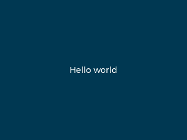

### Example 2 — Button

Default-styled button with a centered label.

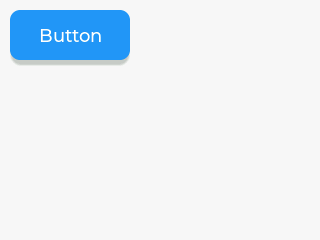

### Example 3 — Custom styles

Two buttons with hand-crafted gradient styles and a darken press filter.
Button 2 uses a fully-rounded (pill) radius.

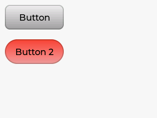

### Example 4 — Slider

Centered slider; label above shows current value, updated live on
`VALUE_CHANGED` events.

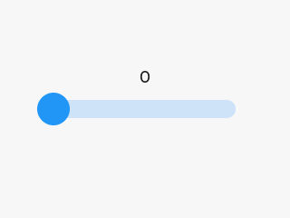

### Example 5 — Simple Horizontal Gradient

Container with a horizontal red→green gradient (opacity 100%→0%), stops at 20% and 80%.

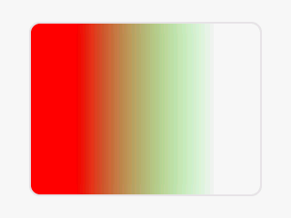

### Example 6 — Linear (Skew) Gradient

Container with a skewed linear gradient from (100,100) to (200,150).

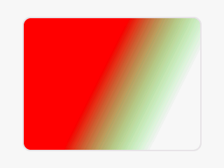

### Example 7 — Radial Gradient

Container with a radial gradient centered at (100,100), focal point at (50,50).

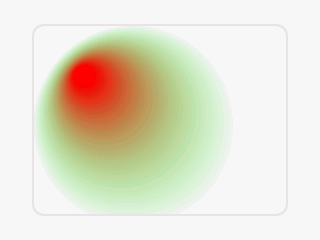

### Example 8 — Conical Gradient

Container with a conical gradient sweeping 0°–180° from center.

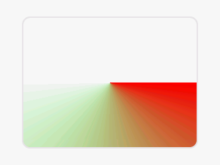

## Styles

### Style 1 — Size, Position and Padding

Object with explicit width, content-based height, padding, and percentage position.

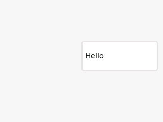

### Style 2 — Background Gradient

Centered object with a two-stop vertical gradient (shifted towards bottom).

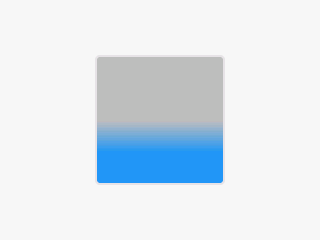

### Style 3 — Border

Centered object with bottom+right blue border on light grey background.

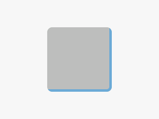

### Style 4 — Outline

Centered object with blue outline and 8px padding around it.

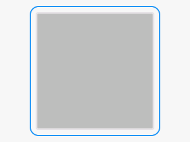

### Style 5 — Shadow

Centered object with a large blue drop shadow.

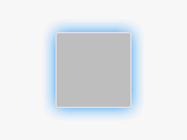

### Style 6 — Image Style Properties

Cogwheel image rotated 30°, blue recolor tint on grey background with blue border.

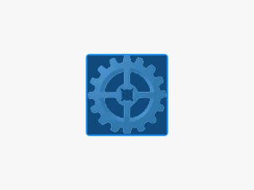

### Style 7 — Arc

Arc widget with red color and 4px width.

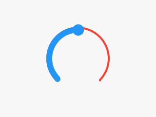

### Style 8 — Text Styles

Text with blue color, letter spacing, line spacing, and underline decoration.

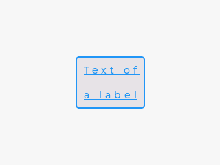

### Style 9 — Line Styles

Grey rounded polyline with 6px width.

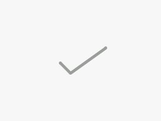

### Style 10 — Transition

Object with animated transitions on press (bg color, border color/width).

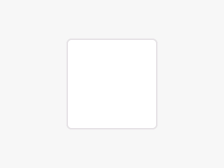

### Style 11 — Multiple Styles

Base (light blue) and Warning (yellow) objects sharing a common style with overrides.

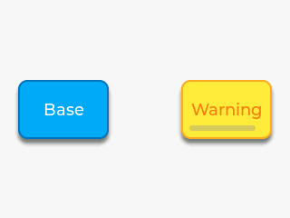

### Style 12 — Local Styles

Green-bordered object with local orange background override.

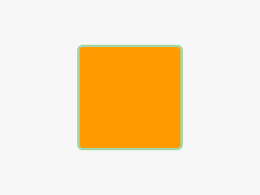

### Style 13 — Parts and States

Slider with gradient indicator and red shadow on pressed state.

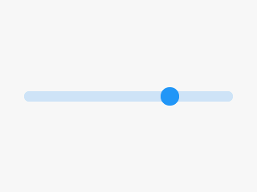

### Style 14 — Extending the Current Theme

Two buttons: the first uses the default theme; after installing a theme extension
the second button is styled green with a dark border automatically by the theme machinery.

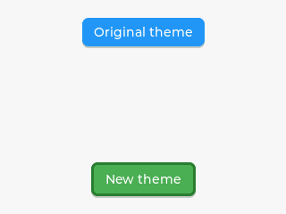

### Style 15 — Opacity and Transformations

Three buttons: normal (100%), 50% opacity, and 50% opacity with 15° rotation and 1.25× scale.
Host screenshot shows opacity only; transforms render correctly on hardware.

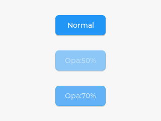

### Style 16 — Conical Gradient

Metallic knob using 8-stop conical gradient with reflected extend and drop shadow.

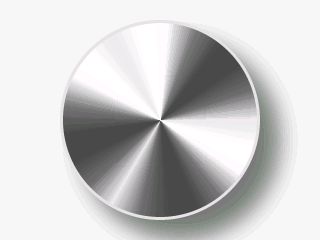

### Style 17 — Radial Gradient

Full-screen radial gradient from purple to black.

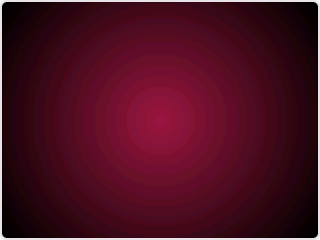

### Style 18 — Gradient Buttons

Four buttons: simple horizontal, simple vertical, complex linear, complex radial gradients.

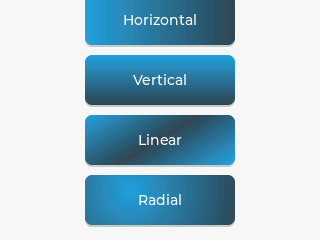

### Skipped

- **Style 19** — Modal overlay (meta-example, benchmarking)

## Animations

### Anim 1 — Start Animation on Event

Switch toggles label X-position animation (overshoot/ease-in paths).

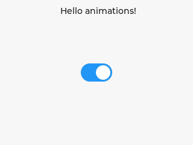

### Anim 2 — Playback Animation

Red circle with repeat/reverse size + X animations (ease-in-out).

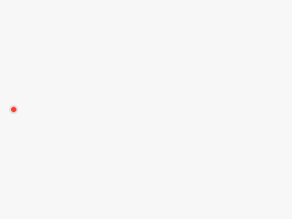

### Anim 3 — Cubic Bezier with Chart

Two sliders (P1, P2) adjust bezier control points. A scatter chart shows the
curve in real-time. Click the play button to animate a red square along the
current bezier curve.

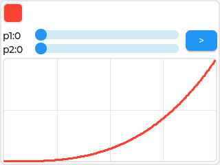

### Anim 4 — Animation with Timed Pause

Switch toggles label X animation (overshoot / ease-in). A one-shot 200 ms timer
pauses the running animation for 1 s.

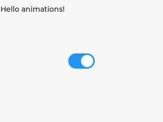

### Anim Timeline 1 — Animation Timeline

Three objects animated via timeline, controlled by start/pause buttons and a progress slider.

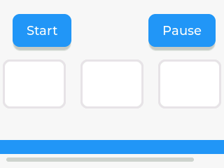

## Events

All event examples use the safe `View::on_event` dispatch — no `unsafe` or raw callbacks in user code.

> **Note:** Hardware target (fire27) has no touch screen yet — input events require a physical input device. The GUI is fully wired; only the physical input is missing.

### Event Click — Button Click Counter

Button increments a counter label on each click.

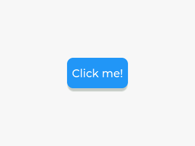

### Event Button — Multiple Event Types

Button reports pressed, clicked, long-pressed, and long-pressed-repeat events to an info label.

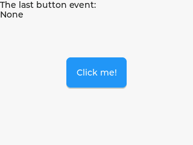

### Event Bubble — Event Bubbling

30-button grid in a flex container; clicking any button turns it red via bubbled events.

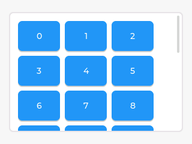

### Event Trickle — Event Trickle-Down

9-cell grid with trickle-down: pressing the container applies a black style to all children.

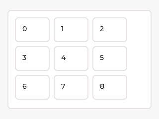

### Skipped

- **Event Draw** — needs `lv_timer_create` + draw task APIs
- **Event Streak** — needs `lv_indev_get_short_click_streak` (requires input device)

## Layouts — Flex

### Flex 1 — Row and Column

Row container (scrollable) and column container with 10 buttons each.

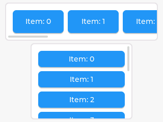

### Flex 2 — Row Wrap with Even Spacing

Style-based flex config: row-wrap flow with `SPACE_EVENLY` alignment. Items are checkable.

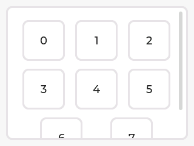

### Flex 3 — Flex Grow

Fixed-size items alongside items with `flex_grow` (1 and 2 portions of free space).

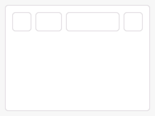

### Flex 4 — Column Reverse

Items added 0–5 but displayed bottom-to-top via `ColumnReverse` flow.

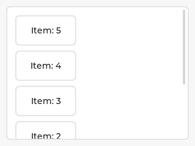

### Flex 5 — Row and Column Gap

Row-wrap layout with animated `pad_row` (500 ms) and `pad_column` (3000 ms) gap changes.

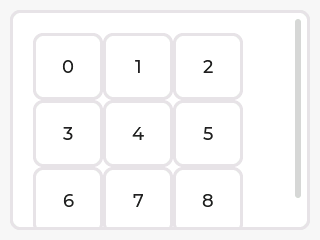

### Flex 6 — RTL Direction

Right-to-left base direction reverses item order in a row-wrap container.

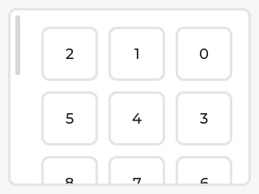

## Layouts — Grid

### Grid 1 — Simple Grid

3×3 grid with fixed 70 px columns and 50 px rows, stretched button cells.

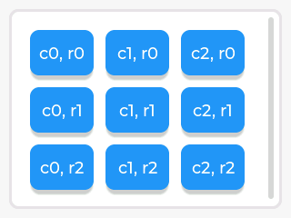

### Grid 2 — Cell Placement and Span

Different cell alignments (START, CENTER, END) and multi-column/row spanning.

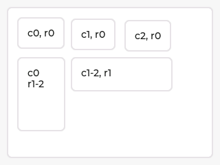

### Grid 3 — Free Units (FR)

Column 1 fixed 60 px, column 2 gets 1 FR, column 3 gets 2 FR of remaining space.

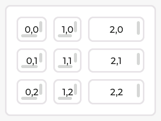

### Grid 4 — Track Placement

`SPACE_BETWEEN` columns, rows aligned to `END` (bottom).

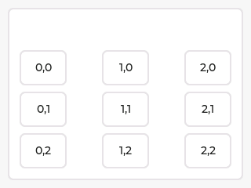

### Grid 5 — Column and Row Gap

3×3 grid with animated row gap (500 ms) and column gap (3000 ms).

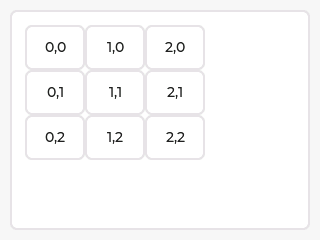

### Grid 6 — RTL Direction

Same 3×3 grid but with `RTL` base direction — cells fill right-to-left.

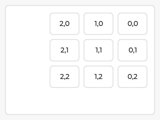

## Scrolling

### Scroll 1 — Basic Scrolling with Save/Restore

Panel with children placed outside its bounds triggers automatic scrolling.
Two buttons save and restore the scroll position.

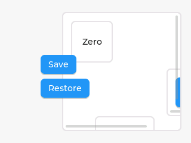

### Scroll 2 — Scroll Snap

Horizontal row of buttons with center snap alignment. Panel 3 is non-snappable.
A switch toggles "scroll one" mode.

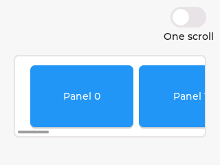

### Scroll 4 — Scrollbar Styling

Custom blue rounded scrollbar that widens and becomes fully opaque when
actively scrolling, with animated transitions.

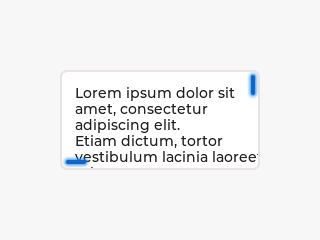

### Skipped

- **Scroll 3** — Floating button in list (needs `LV_USE_LIST`, List wrapper)
- **Scroll 5** — RTL scrolling (needs `LV_FONT_DEJAVU_16_PERSIAN_HEBREW`)
- **Scroll 6** — Curved scroll (needs `lv_obj_get_coords`, `lv_sqrt`, `lv_map`)
- **Scroll 7** — Dynamic widget loading (needs `lv_obj_move_to_index`, Checkbox wrapper)
- **Scroll 8** — Circular list (needs `lv_obj_move_to_index`, content size APIs)

## Widgets — Base Object

### Widget Obj 1 — Base Objects with Custom Styles

Two base objects: a plain one and one with a blue shadow style.


### Widget Obj 3 — Matrix Transform Animation

Centered object with animated scale + rotation via 3×3 matrix transform.


### Skipped

- **Widget Obj 2** — Draggable object (needs `lv_indev_active`, `lv_indev_get_vect` APIs)

## Widgets — Animation Image

### Skipped

- **Widget AnimImg 1** — Animated image frames (needs `AnimImg` wrapper)

## Widgets — Arc

### Widget Arc 1 — Arc with Value Label

Arc with VALUE_CHANGED event; a label follows the arc's knob angle via
`rotate_obj_to_angle` (positions and rotates the label along the arc edge).


### Widget Arc 2 — Animated Arc Loader

Full-circle arc animating 0→100 in 1 s (infinite repeat, 500 ms delay). Knob hidden, not clickable.


### Widget Arc 3 — Donut Chart

Three colored arc segments (red, green, blue) forming a donut chart.


## Widgets — Image

### Widget Image 1 — Basic Image Display

Centered cogwheel image from compiled PNG asset.


### Widget Image 3 — Rotating Image

Cogwheel image rotating continuously via `update()`, using `set_rotation` and `set_pivot`.


### Widget Image 2 — Runtime Image Recoloring

Cogwheel image with RGB + intensity sliders controlling recolor tint.


### Widget Image 4 — Image Offset Animation

Stripe image with yellow background, black recolor, and animated vertical offset.


### Widget Image 5 — Image Inner Alignment

Three images showing different inner alignment modes: default, stretch, tile.


## Widgets — Bar

### Widget Bar 1 — Simple Bar

Simple 200×20 bar at 70%.


### Widget Bar 2 — Styled Progress Bar

Blue-themed bar with custom bg/indicator styles, rounded corners, padding, and animated fill.


### Widget Bar 3 — Temperature Meter

Vertical bar with red-to-blue gradient indicator, animated between -20 and 40 (3 s each direction).


### Widget Bar 4 — Stripe Pattern

Range-mode bar with tiled stripe background image on the indicator at 30% opacity.


### Widget Bar 5 — LTR vs RTL Bars

Two bars: one left-to-right (default), one right-to-left, with labels.


### Widget Bar 7 — Reversed Vertical Bar

Vertical bar filling top-to-bottom via reversed range (100→0), at 70%.


## Widgets — Button

### Widget Button 1 — Click and Toggle

Standard button logging clicks and a checkable toggle button logging state changes.


### Widget Button 2 — Styled Button from Scratch

Button with gradient, shadow, outline, and a transition that expands outline on press.


### Widget Button 3 — Gum Squeeze Animation

Button with transform width/height transitions on press — overshoot easing on release.


## Widgets — Checkbox

### Widget Checkbox 1 — Simple Checkboxes

Four checkboxes: unchecked, checked, disabled, and checked+disabled.


### Widget Checkbox 2 — Radio Button Groups

Two independent groups of checkboxes acting as radio buttons via event bubbling.
Clicking one unchecks the rest in its group.


## Widgets — Dropdown

### Widget Dropdown 1 — Simple Drop-Down

Dropdown with ten fruit options at top center.


### Widget Dropdown 2 — Four Directions

Four dropdowns opening in each cardinal direction (down, up, right, left).


### Widget Dropdown 3 — Menu-Style Dropdown

Dropdown with fixed "Menu" button text and no selected-item highlight.


## Widgets — Label

### Widget Label 1 — Wrap and Scroll

Wrapped centered text and a circularly scrolling label.


### Widget Label 2 — Text Shadow

Fake shadow via duplicate label offset by 2 px with reduced opacity.


### Widget Label 5 — Circular Scroll

Label with scroll-circular long mode — text scrolls in a continuous loop.


## Widgets — LED

### Widget LED 1 — Brightness and Color

Three LEDs: off (dark), dim red (brightness 150), and full on (blue).


## Widgets — Line

### Widget Line 1 — Styled Line

Blue line through 5 points with 8px width and rounded ends.


## Widgets — Roller

### Widget Roller 1 — Month Roller

Infinite roller with month names, 4 visible rows.


### Widget Roller 2 — Styled Rollers with Alignments

Three rollers: left-aligned on green gradient, center-aligned, right-aligned. Shared
selected-row style with Montserrat 20pt font and pink/red highlight.


## Widgets — Scale

### Widget Scale 1 — Round Gauge

270° round scale with labeled major ticks (0–100), built via `Scale::tick_ring`.


### Widget Scale 2 — Horizontal Scale

Horizontal bottom-aligned scale with labeled major ticks from 10 to 40.


### Widget Scale 3 — Round Scale with Needle

Round gauge with animated line needle sweeping 0–100.


### Widget Scale 4 — Round Scale with Sections

Round outer scale with custom labels 1–10, red section (8–10), green section (1–3).


### Widget Scale 5 — Horizontal Scale with Sections

Horizontal scale 0–100 with colored sections: blue (0–25), red (75–100).


### Widget Scale 6 — Clock with Timer-Driven Needles

Round clock face with minute and hour hands updated by a 250 ms Timer.


### Widget Scale 8 — Round Scale with Rotated Labels

Round inner scale with labels rotated to match tick angles, pink background, and needle.


### Widget Scale 9 — Horizontal Scale with Rotated Labels

Horizontal bottom scale with 45° rotated major tick labels.


### Widget Scale 10 — Heart Rate Gauge

Round gauge with timer-driven needle oscillating between 80–180 BPM.


## Widgets — Slider

### Widget Slider 1 — Slider with Value Label

Centered slider with a label below showing the current value (updated in `update()`).


### Widget Slider 2 — Styled Slider

Cyan slider with pill-shaped track, padded knob with border, bg-color transition on press.


### Widget Slider 3 — Range Slider

Range-mode slider with two handles and a label showing min–max values.


### Widget Slider 4 — Reversed Slider

Slider with opposite direction (100→0) and percentage label below.


## Widgets — Switch

### Widget Switch 1 — Toggle Switches

Four switches in a column: default, checked, disabled, and checked+disabled.


### Widget Switch 2 — Horizontal and Vertical

Horizontal switch (default) and vertical switch (pre-checked), using `set_orientation`.


## Implementation Coverage

Status of all [LVGL 9.3 examples](https://docs.lvgl.io/9.3/examples.html) in oxivgl.

**Legend:** Done = ported, Skip = intentionally skipped (reason noted), Missing = has wrapper but no example yet, No wrapper = widget not yet wrapped.

### Core Examples

| Category | LVGL | Done | Skip | Notes |
|---|---|---|---|---|
| Getting Started | 4 | 4 (+4 extra gradient examples) | 0 | |
| Styles | 19 | 18 | 1 | style19 (meta/benchmarking) |
| Animations | 5 | 5 | 0 | |
| Events | 5 | 3 (+1 extra trickle) | 2 | event_draw (timer API), event_streak (indev API) |
| Flex | 6 | 6 | 0 | |
| Grid | 6 | 6 | 0 | |
| Scroll | 8 | 3 | 5 | scroll3 (List), scroll5 (font), scroll6–8 (APIs) |

### Widget Examples (wrapper exists)

| Widget | LVGL | Done | Missing | Notes |
|---|---|---|---|---|
| obj | 3 | 2 | 0 | obj2 skipped (needs indev API) |
| arc | 3 | 3 | 0 | |
| bar | 7 | 6 | 1 | bar6 (needs custom draw event) |
| button | 3 | 3 | 0 | |
| checkbox | 2 | 2 | 0 | |
| dropdown | 3 | 3 | 0 | |
| image | 5 | 5 | 0 | |
| label | 6 | 3 | 3 | label3 (RTL fonts), label4 (canvas mask), label6 (custom font) |
| led | 1 | 1 | 0 | |
| line | 1 | 1 | 0 | |
| roller | 3 | 2 | 1 | roller3 (needs canvas/mask API) |
| scale | 11 | 9 | 2 | scale7 (draw task), scale11 (draw task) |
| slider | 4 | 4 | 0 | |
| switch | 2 | 2 | 0 | |

### Widgets Without Wrappers

animimg, buttonmatrix, calendar, canvas, imagebutton, keyboard, list, lottie, menu, msgbox, span, spinbox, spinner, table, tabview, textarea, tileview, win.

### Totals

| | Count |
|---|---|
| LVGL examples total | ~184 |
| oxivgl done | 97 |
| Skipped (intentional) | 9 |
| Missing (wrapper exists) | ~6 |
| No wrapper | ~68 |

## Running

```sh
# Interactive SDL2 window:
./run_host.sh getting_started1

# Headless screenshot (no window):
./run_host.sh -s getting_started1

# Screenshot all examples:
./run_host.sh -s

# Flash to ESP32:
./run_fire27.sh getting_started1
```
