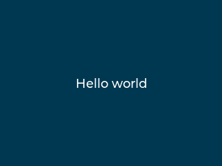
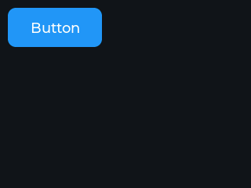
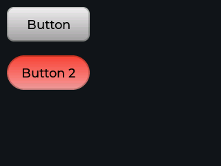
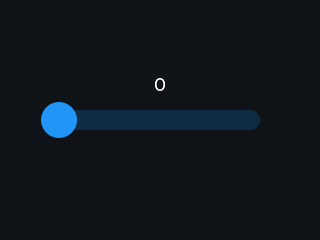

# oxivgl — Getting Started Examples

Rust ports of the [LVGL Getting Started examples](https://docs.lvgl.io/9.3/examples.html).

Each example runs on both **ESP32 (fire27)** via the `examples/fire27` crate and on the
**x86_64 host** (this crate) for rapid iteration and screenshot capture.

## Examples

### Example 1 — Hello World

Dark blue screen, centered white label.



### Example 2 — Button

Default-styled button with a centered label.



### Example 3 — Custom styles

Two buttons with hand-crafted gradient styles and a darken press filter.
Button 2 uses a fully-rounded (pill) radius.



### Example 4 — Slider

Centered slider; label above shows current value, updated live on `VALUE_CHANGED` events.
On host (SDL2) the slider is fully interactive via mouse.



## Running on host

```sh
# Interactive demo (loops until Ctrl-C):
LIBCLANG_PATH=/usr/lib64 cargo run -p oxivgl-examples-get-started --bin ex1 \
    --target x86_64-unknown-linux-gnu --config 'unstable.build-std=["std"]'

# Capture screenshots to examples/get-started/screenshots/:
LIBCLANG_PATH=/usr/lib64 cargo test -p oxivgl-examples-get-started --test screenshots \
    --target x86_64-unknown-linux-gnu --config 'unstable.build-std=["std"]'
```

## Running on fire27 (M5Stack Fire / ESP32)

```sh
cargo run -p oxivgl-examples-fire27 --bin ex1
```
